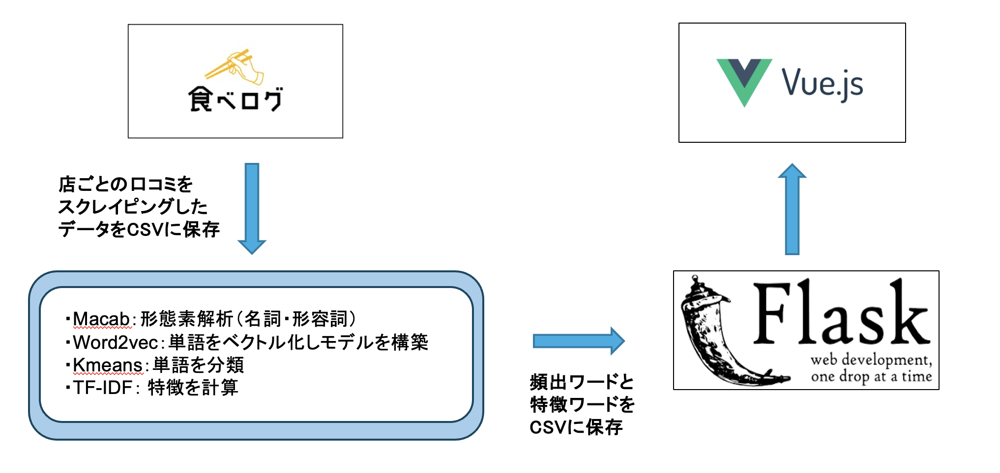

# Bakery_App

## パンの口コミ解析アプリ
- パンの口コミを収集し、自然言語処理を用いて解析
- パン屋ごとに特徴単語と写真をカード形式で表示

## システム構成図

## 使用技術
### フロントエンド
- Vue2
- Vuetify2
  
### バックエンド
- Python
- Flask

## 参考文献
- スクレイピング
  - https://qiita.com/toshiyuki_tsutsui/items/f143946944a428ed105b

- NEologd辞書
  - https://resanaplaza.com/2022/05/08/%E3%80%90%E8%B6%85%E7%B5%B6%E7%B0%A1%E5%8D%98%E3%80%91windows-%E3%81%AEpython%EF%BC%8Bmecab%E3%81%A7%E3%83%A6%E3%83%BC%E3%82%B6%E3%83%BC%E8%BE%9E%E6%9B%B8%E3%81%ABneologd%E3%82%92%E4%BD%BF%E3%81%86/

- 不要単語除去
  - https://ohke.hateblo.jp/entry/2019/02/09/141500

- 分かち書き、モデル構築など
  - https://qiita.com/toshiyuki_tsutsui/items/19590b464f15f845efcd

- TF-IDF
  - https://www.takapy.work/entry/2019/01/14/142128
  - https://qiita.com/toshiyuki_tsutsui/items/b3ac8fd1b300c3404508
 
- 仮想環境
  - https://www.python.jp/install/windows/venv.html

- Flask
  - https://tech-market.org/vue-flask-cooperation/
  - https://qiita.com/plumfield56/items/2c21642a464d3ced3ac0

- Vue.js
  - https://qiita.com/rubytomato@github/items/811e534805bbf659b5af
  - https://qiita.com/Motonosuke/items/34512917704a1c883832
  - https://vuetifyjs.com/ja/components/cards/
  - https://vuetifyjs.com/ja/styles/colors/  

## その他
- 2022年7月頃製作（学部3年）